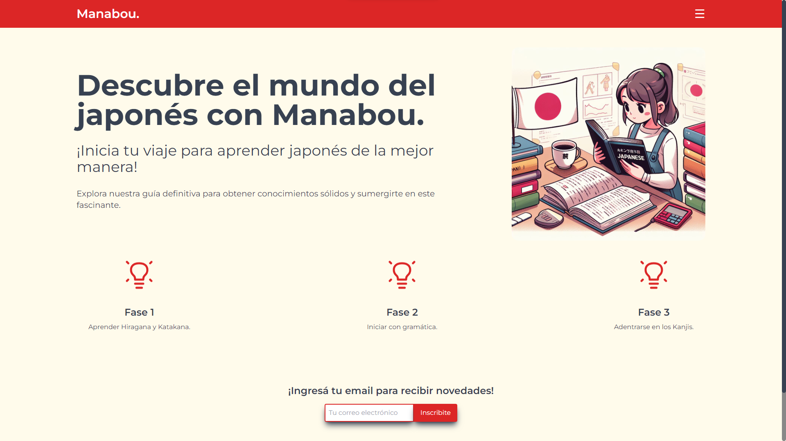

<h1 align="center">Manabou.</h1>

**Manabou.** is a personal project, in which I want to capture the problems I had when I wanted to start my studies of the Japanese language. That is what this site aims to solve, its main intention is for the future student to learn how to start.

##  Helpful Links

<a href="https://manabou.vercel.app">Deploy</a>

## Manabou. consists of 4 sections:

- ###  Homepage
Where you can find an invitation to start your Japanese studies. The steps to efficiently learn Japanese are outlined, and below, there is a form to enter your email and subscribe to the newsletter.

- ### Institutes
Where you can find detailed information about all the institutes available in the CABA area of Argentina, with plans to add institutes from the rest of the country later.

- ### Material
Which contains 46 cards featuring hiragana symbols. Clicking on each card reveals its corresponding katakana counterpart. More material will be added in the future.

- ### Videos & Courses
Where three videos are embedded, showcasing the top three courses to begin learning the Japanese language.

## Tech Stack Used

## Contributions and Contact

If you're interested in collaborating on projects or have any questions, feel free to reach out to me:

- **Email:** halejandrorosa@gmail.com
- **LinkedIn:** [Alejandro Rosa](https://www.linkedin.com/in/h-alejandro-rosa/)
- **GitHub:** [SamotSama](https://github.com/SamotSama)
- **Porftolio:** [Alejandro Rosa Dev](https://samotsama-dev.vercel.app)

